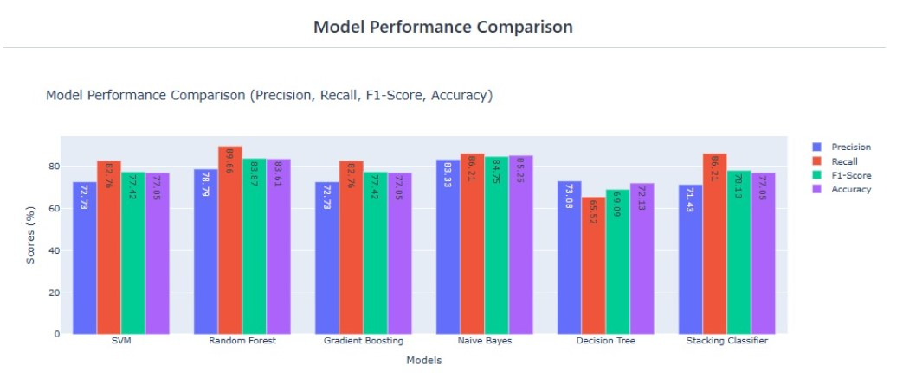
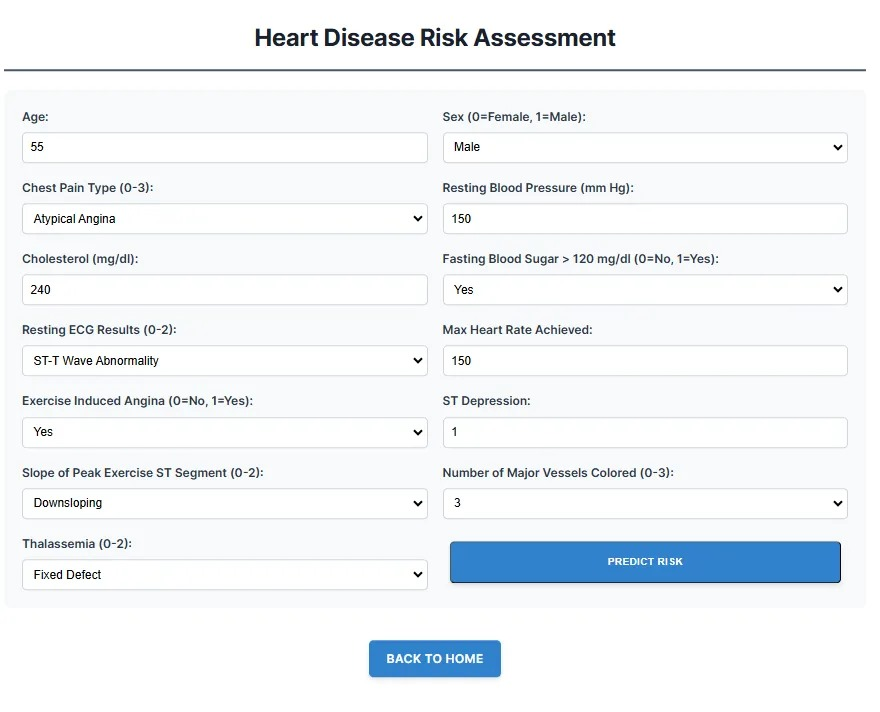
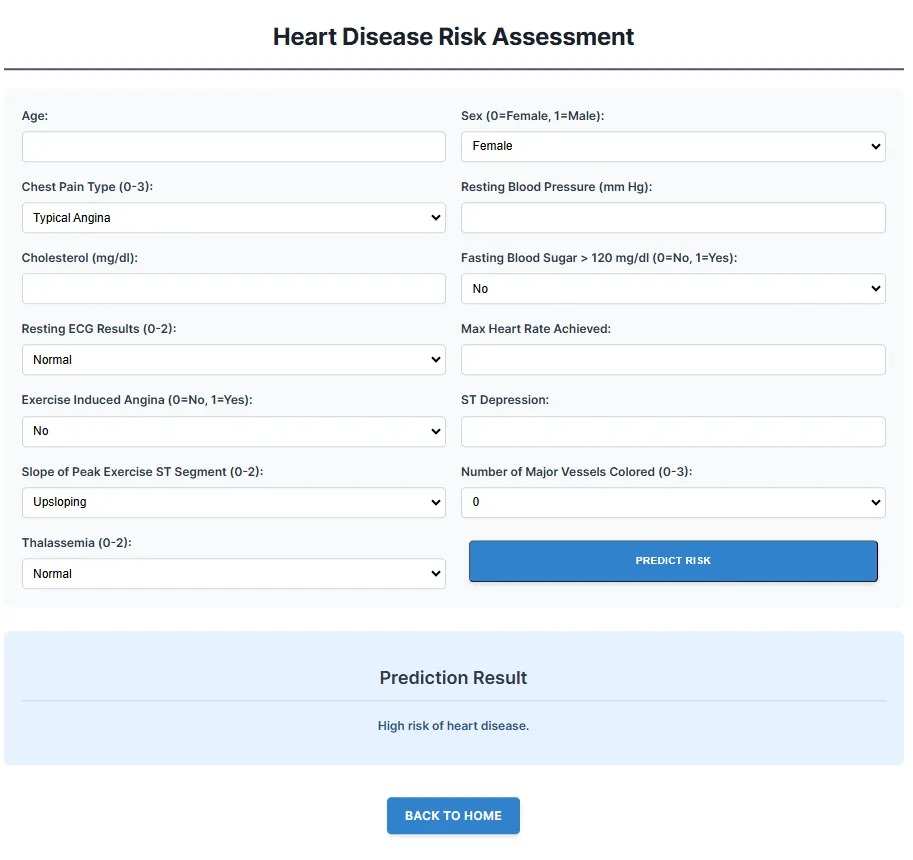

# Heart Disease Risk Predictor 

This project aims to develop a machine learning model capable of predicting the likelihood of heart disease based on various health indicators. The model is built using Python and popular data science libraries, including Pandas, NumPy, and Scikit-learn.

## **Project Overview**
The goal of this project is to create a web application that can assess an individual's risk of developing heart disease. By inputting various health parameters, the user can receive a prediction of their heart disease risk.


## **Dataset**
The project uses the "heart.csv" dataset obtained from [Kaggle](https://www.kaggle.com/datasets/johnsmith88/heart-disease-dataset/data). The dataset contains 1025 instances with 14 attributes, including demographic information (age, sex), medical measurements (resting blood pressure, cholesterol levels, etc.), and a binary target variable indicating the presence or absence of heart disease.

## **Model Training and Evaluation**

Several machine learning models were trained and evaluated using cross-validation and test set performance:

- **Decision Tree Classifier**
- **Naive Bayes Classifier**
- **Support Vector Machine (SVM)**
- **Gradient Boosting Classifier**
- **Random Forest Classifier**
- **Stacking Classifier**

The models were trained on the scaled training data, and their performance was evaluated using metrics such as accuracy, precision, recall, and F1-score. The Naive Bayes Classifier achieved the highest test accuracy of 85.25% after hyperparameter tuning, outperforming other models, including Random Forest (83.61%) and SVM (77.05%).


## **Screenshots**

### Model Performance Comparison


### Heart Disease Risk Assessment Form


### Prediction Result


## **How to Use the Application**

### 1. Clone the Repository
```bash
git clone https://github.com/hower-pazos/Heart-Disease-Risk-Predictor
```
### 2. Install the Required Dependencies
```bash
pip install -r requirements.txt
```
### 3. Run the Flask Application
```bash
python app.py
```
### 4. Access the Application
Open your web browser and navigate to [http://localhost:5000] to access the Heart Disease Prediction application.